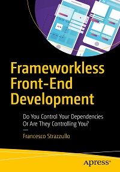

# Apress Source Code for Frameworkless Front-End Development

This repository accompanies [*Frameworkless Front-End Development*](http://www.apress.com/9781484249666) by Francesco Strazzullo (Apress, 2019).

[comment]: #cover

Download the files as a zip using the green button, or clone the repository to your machine using Git.

## Releases

Release v1.0 corresponds to the code in the published book, without corrections or updates.

## Contributions

See the file Contributing.md for more information on how you can contribute to this repository.

## Chapters

### [Chapter 1 - Let's Talk About Frameworks](https://github.com/francesco-strazzullo/frameworkless-examples/tree/master/Chapter01)
### [Chapter 2 - Rendering](https://github.com/francesco-strazzullo/frameworkless-examples/tree/master/Chapter02)
### [Chapter 3 - Managing DOM Events](https://github.com/francesco-strazzullo/frameworkless-examples/tree/master/Chapter03)
### [Chapter 4 - Web Components](https://github.com/francesco-strazzullo/frameworkless-examples/tree/master/Chapter04)
### [Chapter 5 - HTTP Requests](https://github.com/francesco-strazzullo/frameworkless-examples/tree/master/Chapter05)
### [Chapter 6 - Routing](https://github.com/francesco-strazzullo/frameworkless-examples/tree/master/Chapter06)
